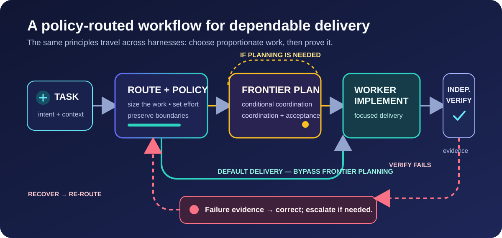

# polytropos

> *aesop tells the fables; polytropos finds the way.*

`CLAUDE CODE` · `GITHUB COPILOT CLI` · `CODEX CLI`

**Policy-guided routing** · **evidence-gated recovery** · **maintained documentation**

Polytropos is a cross-harness routing and workflow kit for coding agents. It helps you select an appropriate model before an expensive task, preserve a clear plan, and use independent verification with recovery based on evidence. Start in the CLI you already use.

## Start here

Choose one harness. Install paths and model rosters are intentionally separate; each has its own configuration and pricing data.

| Harness | Install | First useful action |
|---|---|---|
| **Claude Code** | `/plugin marketplace add /path/to/polytropos` `/plugin install polytropos@polytropos-local` CLI: `claude plugin marketplace add /path/to/polytropos` `claude plugin install polytropos@polytropos-local` | Run `/polytropos:route <task>` before a substantial task. |
| **GitHub Copilot CLI** | `python3 bin/harness_select.py detect` `python3 bin/harness_select.py install --harness copilot` | In Copilot, choose `/agent` → `route`, or run `copilot --agent route --prompt "<task>"`. |
| **Codex CLI** | `codex plugin marketplace add /path/to/polytropos` `codex plugin add polytropos@polytropos-local` | Open `/skills` and invoke `$route <task>`; do not rely on a bare `/route` alias. |

Claude Code can also use a one-off checkout with `claude --plugin-dir /path/to/polytropos`. Copilot’s installer refreshes only its unchanged managed files and preserves conflicting personal edits; use `--dry-run` to inspect destinations first. Codex packages are cached, so start a new task after installing. For Codex package preparation and optional project roles, use the [Codex harness guide](docs/CODEX-HARNESS.md).

Once installed, discover the workflows in your host: Claude uses `/polytropos:*` commands; Copilot uses `/skills reload`, `/skills list`, and `/agent` (a skill name is not a native slash command); Codex uses `/skills` and `$skill` invocations. Claude’s `/polytropos:setup` manages its own status line; Codex’s `$setup` configures the native Codex status line, while `$usage` reads local activity. The [Copilot installation guide](copilot-docs/INSTALL.md) and [Codex skill guide](docs/CODEX-HARNESS.md#skills-and-legacy-copies) explain the different discovery and setup paths.

## The workflow in one screen

Routine work can go straight from routing to a suitable worker. Complex work gets a planning pass; failed verification carries evidence into targeted recovery and another check. Routing is advice and a policy boundary, not a claim that every host dispatch is observed. Each harness records what it can know, keeps direct user-selected runs outside the policy boundary, and leaves unverified runtime facts marked as unknown.

## What you get

- A task-first router that compares suitable candidates and returns the next command.
- A plan → execute → independently verify loop for work that warrants it.
- Escalation that carries failure evidence instead of routinely starting at the most capable model.
- Local usage, freshness, graph-grounding, assessment, and benchmark-planning tools, with capability differences documented per harness.

The detailed mechanics, limits, and examples live in the [documentation site](https://agentmc15.github.io/polytropos/), [architecture guide](docs/HOW-IT-WORKS.md), and [complete guide & cookbook](docs/GUIDE.md). For harness-specific behavior, see [Claude skills](skills/), [Copilot CLI](docs/COPILOT-HARNESS.md), and [Codex CLI](docs/CODEX-HARNESS.md).

Polytropos also has a [Cursor headless harness](docs/CURSOR-HARNESS.md). Its adapter and bundle are separate from the three quick starts above, and its usage remains unpriced where no rates are known.

## Current model routes

These are **configuration snapshots checked on 2026-09-24**, not an automatic feed of new releases or a guarantee for every account. Each harness has its own pricing and model registry; public availability and your client’s picker can still differ. The links lead to the provider catalogs used for this refresh.

| Harness | Current Polytropos routes | Why an older model may still appear |
|---|---|---|
| **Claude Code** · [Anthropic lineup](https://platform.claude.com/docs/en/models/overview) | Fable 5.1 (frontier), Opus 5.5 (strong), Sonnet 5 (mid), Haiku 4.5 (cheap). | Prior generations remain for historical estimates and explicit compatibility pins where the provider still supports them. |
| **Codex CLI** · [OpenAI lineup](https://developers.openai.com/api/docs/models) | GPT-6 Astra (reserved orchestration), GPT-6 Sol (strong work and verification), GPT-5.6 Terra (mid work), GPT-6 Luna (cheap work). | Terra remains the available mid-tier worker; older Sol/Luna entries are cost-only. |
| **GitHub Copilot CLI** · [GitHub CLI model support](https://docs.github.com/en/copilot/reference/ai-models/supported-models) | The curated roster now includes GPT-6 Astra/Sol/Luna, Claude Fable 5.1 and Opus 5.5, Gemini 3.8 Flash, MAI-Code-1.1-Flash, Grok 4.7, and Kimi K3 alongside retained models. | Published support alone does not grant an account access; check `/model` and your organization’s policies. Fable 5.1 has a [data-retention caveat](https://docs.github.com/en/copilot/reference/ai-models/supported-models). |

The canonical files are [Claude `data/pricing.json`](data/pricing.json), [Codex `data/pricing.codex.json`](data/pricing.codex.json), and [Copilot `data/pricing.copilot.json`](data/pricing.copilot.json). Rates, context thresholds, tier defaults, and availability notes belong there; a public catalog entry never silently becomes a routing target.

## Important security boundaries

> **Read this before unattended use.** On macOS, kit verification commands run inside an OS boundary (`bin/exec_policy.py`, `sandbox-exec`): writes are confined to the workspace, network access is denied, and credential stores are unreadable. This is the default and it refuses rather than silently downgrading.
>
> **Linux and Windows do not yet have a confinement backend.** Verification there requires the explicit `--exec-mode trusted-host`, which enforces nothing. Benchmark candidate and judge dispatch are not yet confined on any platform. Read [SECURITY.md](SECURITY.md) for the enforced scope, exclusions, and operating guidance.

The Codex repo-bench port is planning-only and structurally refuses live candidate and judge dispatch. A ChatGPT-plan dollar figure is an API-equivalent proxy, not an actual bill or a spend ceiling. The Copilot and Claude tools likewise label the limits and provenance of their own estimates—do not combine their pricing surfaces.

## Keep going

- [Manual documentation site](https://agentmc15.github.io/polytropos/) — maintained, cross-harness reference.
- [Full reference](docs/REFERENCE.md) — every model, role, skill, engine and harness on one long page.
- [How it works](docs/HOW-IT-WORKS.md) — architecture and policy rationale.
- [Guide & cookbook](docs/GUIDE.md) — skill reference and worked examples.
- [Copilot documentation center](copilot-docs/README.md) — task-oriented Copilot material.
- [Release support matrix](docs/RELEASE.md) — verified versus unknown capability status.
- [Update skill](skills/update/SKILL.md) — read-only freshness check before a refresh.

Polytropos is named for the “many-wayed” Odysseus: use the smallest capable path, keep the evidence, and make the exceptional path explicit.
